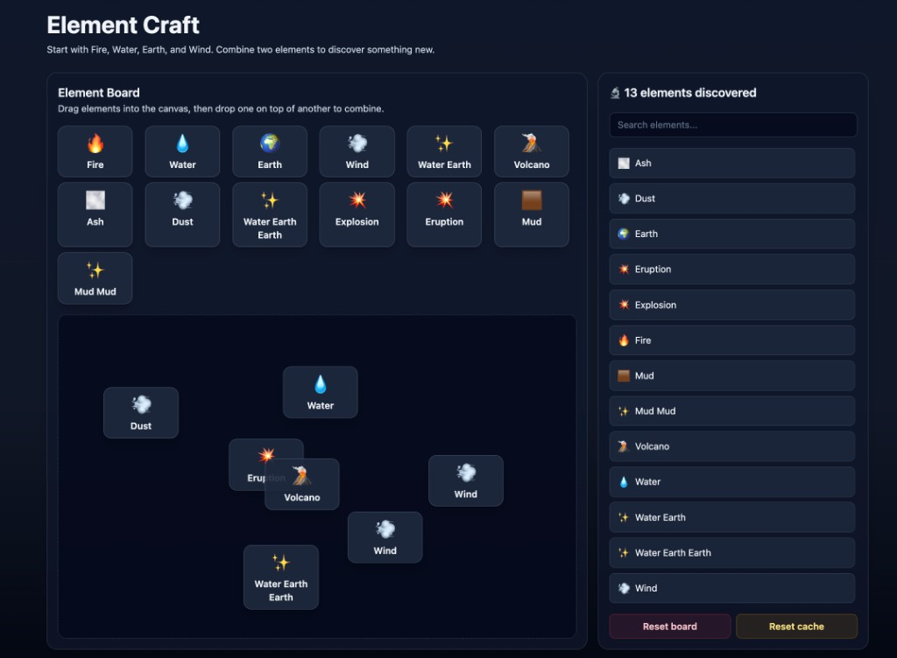

# Element Craft

Element Craft is an Infinite Craft-style web game built with React + TypeScript + Vite.
Players start with base elements and combine them to discover new ones.

## Screenshot


<!-- Save the screenshot file at docs/element-craft-screenshot.png -->

## Tech Stack

- React 19
- TypeScript
- Zustand
- Vite
- Tailwind CSS
- Gemini API (server middleware in `vite.config.ts`)

## What This Project Does

- Drag, move, and combine discovered elements on a board
- Call Gemini to generate new combined elements
- Fall back safely if the model is unavailable or rate-limited
- Track discovered elements in app state

## Prerequisites

- Node.js 20+ recommended
- npm 10+ recommended
- A Gemini API key from Google AI Studio

## Local Setup

1. Install dependencies:

   ```bash
   npm install
   ```

2. Create your local env file:

   ```bash
   cp .env.example .env
   ```

3. Fill in `.env`:

   ```env
   GEMINI_API_KEY=your_api_key_here
   GEMINI_MODEL=gemini-2.5-flash
   ```

4. Start the dev server:

   ```bash
   npm run dev
   ```

5. Open the local URL shown in terminal (usually `http://localhost:5173`).

## Scripts

- `npm run dev` - Start local dev server
- `npm run build` - Type-check and build production bundle
- `npm run lint` - Run ESLint
- `npm run preview` - Preview production build

## Environment Variables

- `GEMINI_API_KEY` - required API key used by Vite server middleware
- `GEMINI_MODEL` - Gemini model name (default currently `gemini-2.5-flash`)

## Security and Public Repos

- Do not commit `.env` or any real secrets.
- Keep keys in local `.env` only.
- Use `.env.example` for placeholders and onboarding.
- If a key is ever exposed, revoke and rotate it immediately.

## Notes

- Gemini requests are made in Vite server middleware (`/api/combine`) so the API key stays server-side during development.
- The app uses a fallback element response if Gemini fails or is rate-limited.
